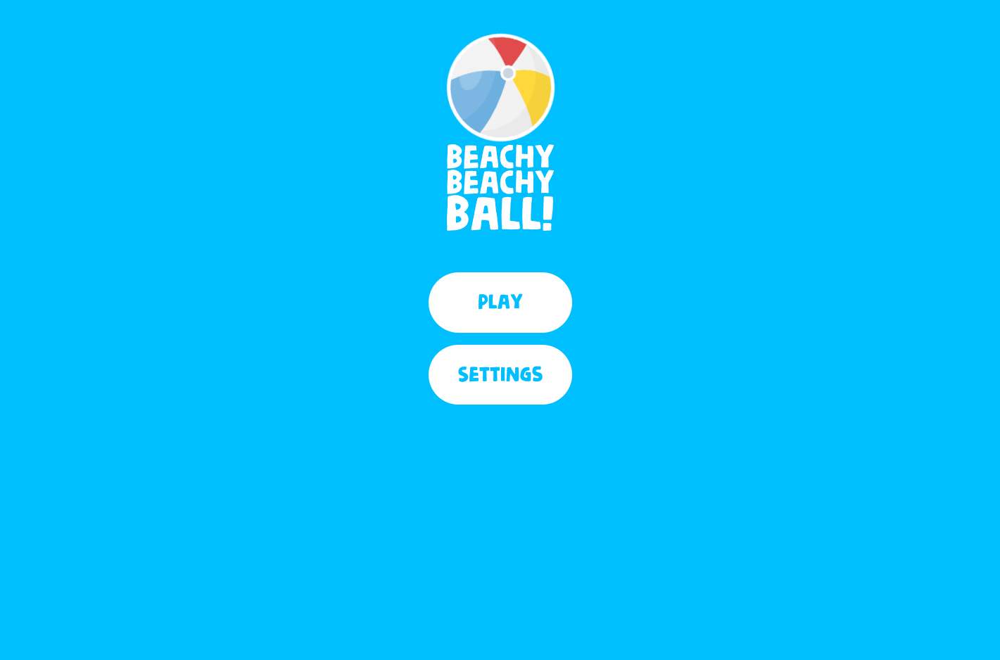
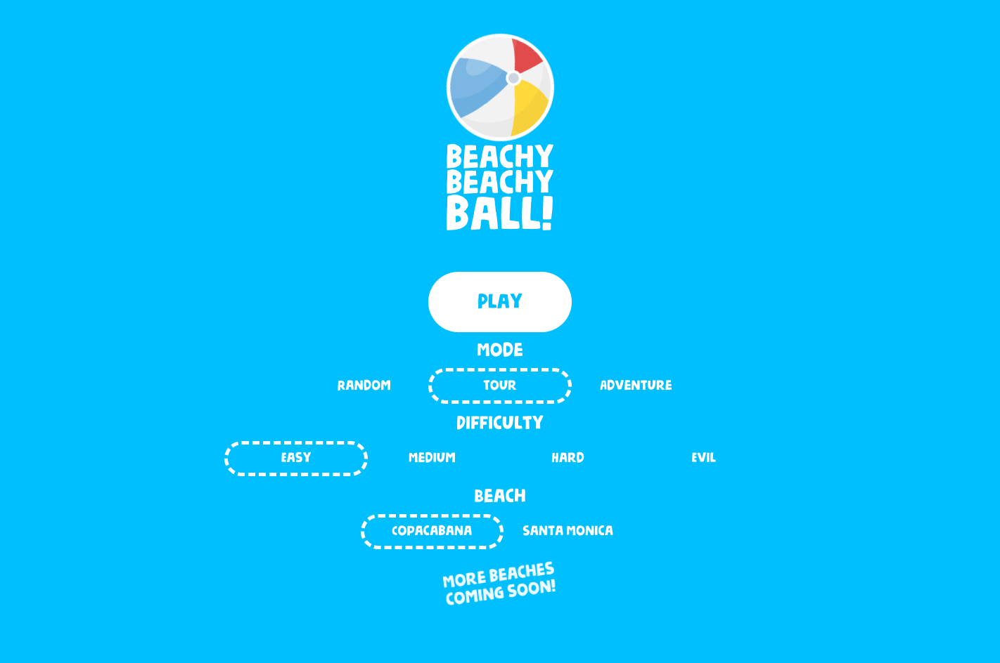
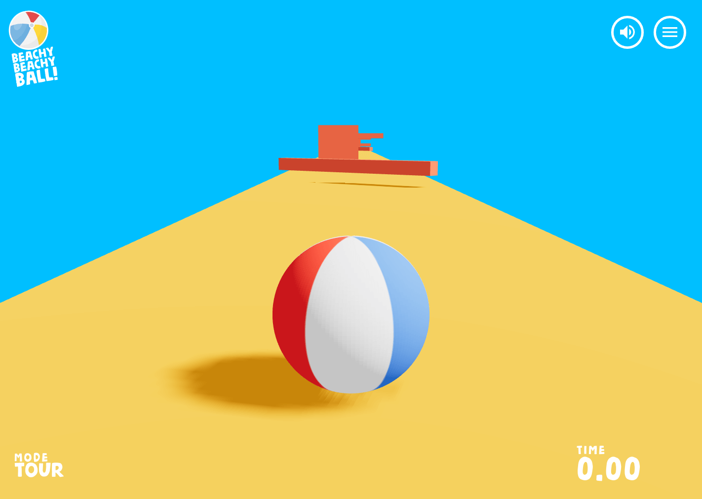
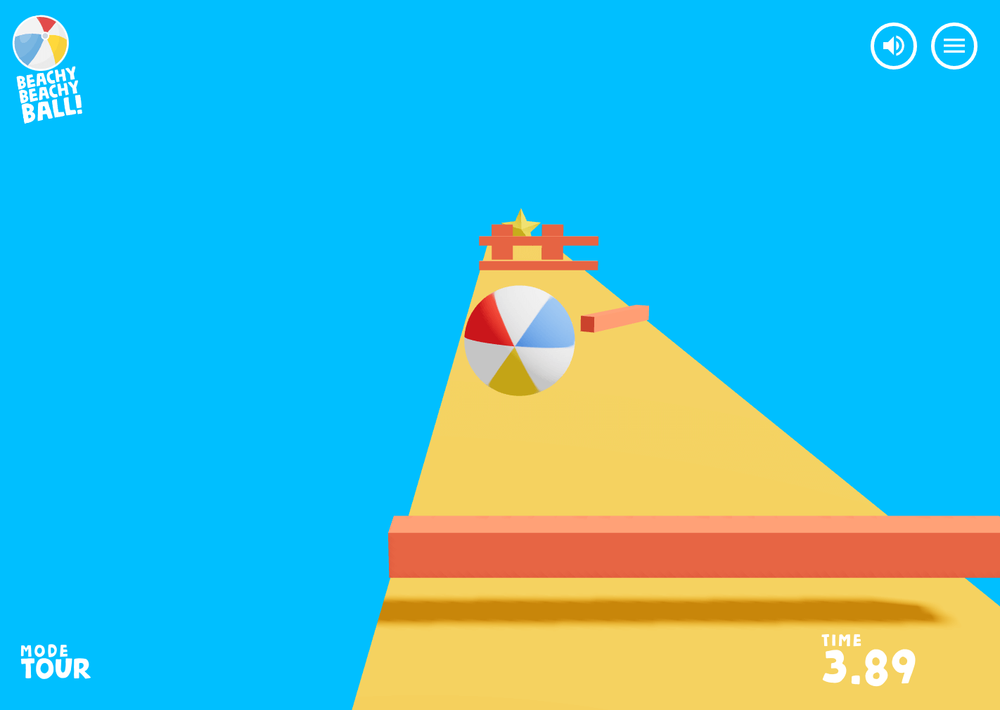
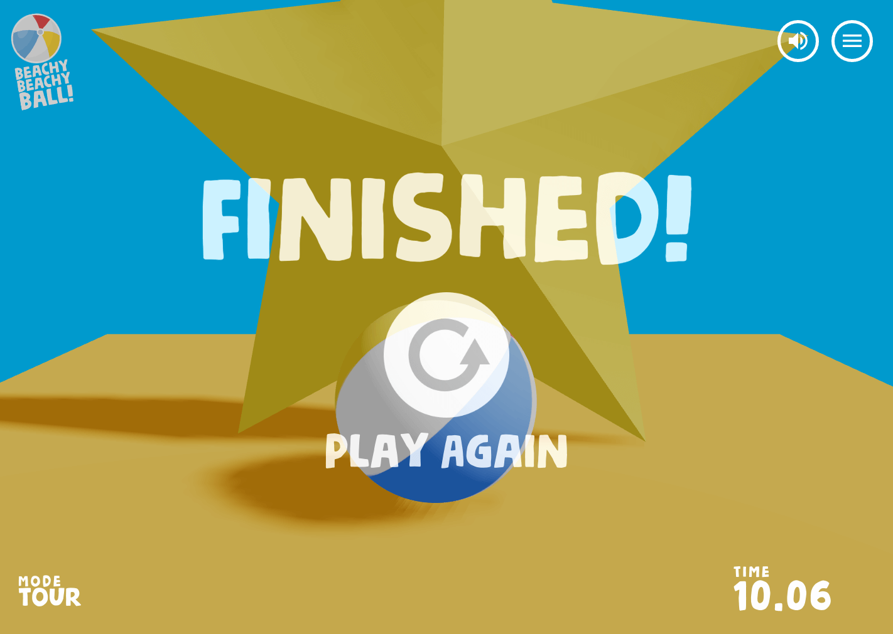
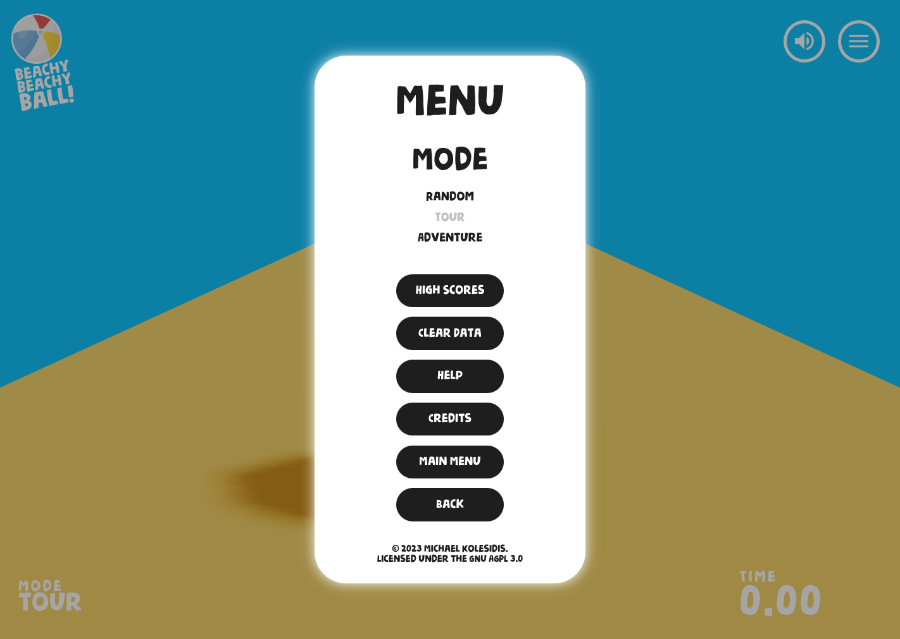

# Beach Ball Game

## Technologies

The core technologies used are _JavaScript_ and _WebGL_. The following libraries and tools are used:

| Name              | License | Description                                  |
| ----------------- | :-----: | -------------------------------------------- |
| React             |   MIT   | Component-based, front-end interface library |
| Three.js          |   MIT   | 3D graphics API for the web, based on WebGL  |
| React Three Fiber |   MIT   | A React renderer for Three.js                |
| Drei              |   MIT   | Useful helpers for React Three Fiber         |
| Zustand           |   MIT   | State management                             |
| Vite              |   MIT   | Frontend development tooling                 |

## Screenshots

### Controls

|  Button(s)   |           Action            |
| :----------: | :-------------------------: |
| ←↑→↓ or WASD |            Move             |
|    Space     |            Jump             |
|    Enter     |  Start game (on main menu)  |
|      M       |         Mute/Unmute         |
|      R       |           Restart           |
|      P       |   Show performance stats    |
|     Esc      | Toggle menu modal (in game) |
